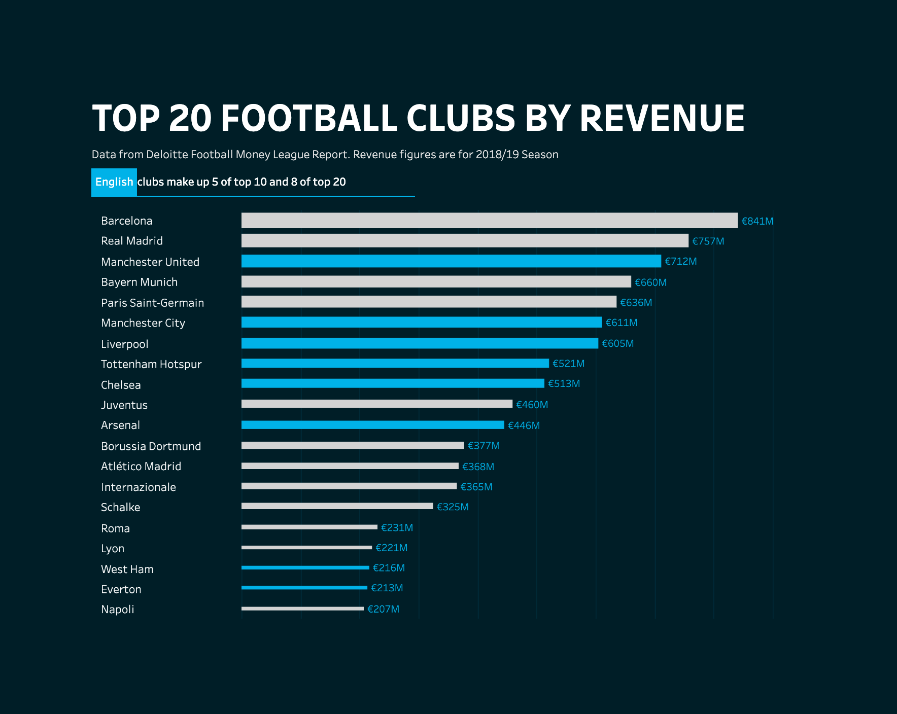
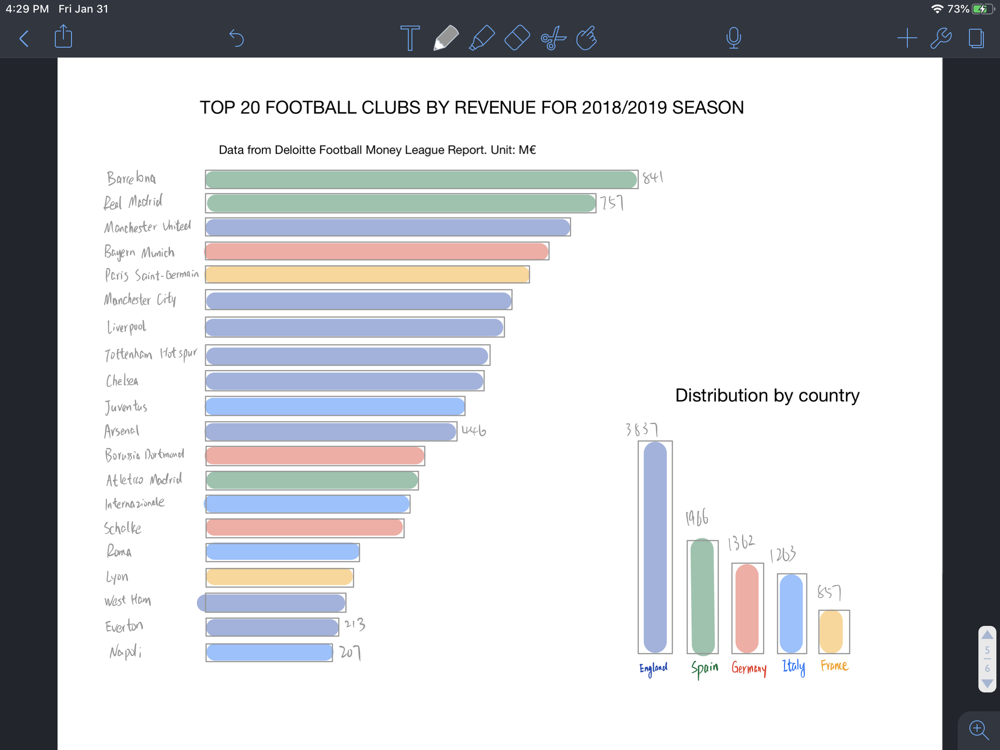
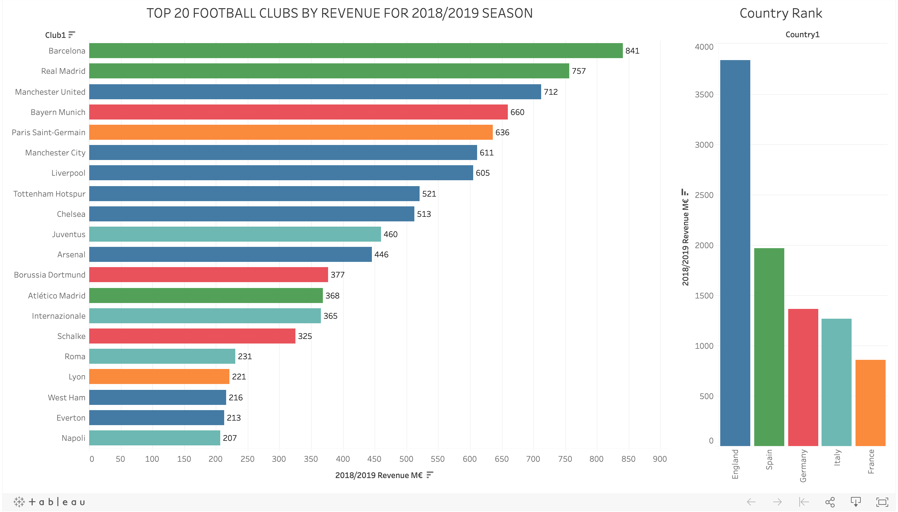

# Step 1: find a data visualization

The figure I found is from tabuleau public. Data of this figure could be accessed by clicking the download button on the right below of the graph. The link is:

https://public.tableau.com/en-us/gallery/revenue-football-clubs?tab=viz-of-the-day&type=viz-of-the-day

There is something woring with the tableau public embedding. I attached a screenshot of the figure:

# Step 2: critique the data visualization

Answers also submitted in google form

- Usefulness: 9
- Completeness: 5
- Perceptibility: 7
- Truthfulness: 8
- Intuitiveness: 7
- Aesthetics: 7
- Engagement: 6

- Describe your overall observations about the data visualization here. What stood out to you? What did you find worked really well? What didn't? What, if anything, would you do differently?
    - What stood out:
      - a bar chart
      - Revenue ranks
    - Worked really well:
      - clear ranking of top 20 clubs
      - highlight English clubs 
    
    - Didn't work well:
      - width of the bar is unnecessary
      - no other country is listed 
      - repeated legend info in each bar
    
    - I want to do differently:
      - add a graph to comparing English vs other countries
      - unify the bar width
      - bar legend modification
      
- Who is the primary audience for this tool? Do you think this visualization is effective for reaching that audience? Why or why not?
  - Pramiary aucidence would be football fans, investers, managers in football business and people who are generall interested in football. This visualization is effective for reaching the audience, it clearly showed the rank and revenue for the top 20 football clubs and the English clubs. However, it could do better.

- Final thoughts: how successful what this method at evaluating the data visualization you selected? Are there measures you feel are missing or not being captured here? What would you change? Provide 1-2 recommendations (color, type of visualization, layout, etc.)
  - This method delivers a comprehensive evaluation of data viz from many perspective and also present the result in an eye-friendly visualization. However, all those questions are somewhat highlevel questions without pointing to the details of paragraph like what type of chart should you choose and how do like the legend of each axis. The recommedations are: 
    - How do you like the overall color arrangement of the figure? 
    - How do you think the display of each axis? Are they effective to demonstrating the info?
    - Do you experience a heavy eye travelling in the figure?

# Step 3: wireframe a solution
Attached is my sketch:

# Step 4: test the solution
Below is the answers I got from asking my friends:
- Can you tell me what you think this is?
    - Bar charts of revenue of footaball clubs
    - Some revenue, expenditure

- Can you describe to me what this is telling you?
    - England clubs take the most part
    - How much is the revenue for each club

- Is there anything you find surprising or confusing?
    - Revenue composition
    - club names are not familiar with people unfamiliar with football
    - value of each bar

- Who do you think is the intended audience for this?
    - hooper fan, fan of football, sport television, football game player
    - People who likes football, company who engaging get profit to get more money

- Is there anything you would change or do differently?
    - Modify the legends
    - Color the legend into corresponding color with the bar

# Step 5: my solution
Published on tableau public:

https://public.tableau.com/profile/jiang.chang#!/vizhome/Football_Revenue/Dashboard1?publish=yes

Screenshot ttached here:

