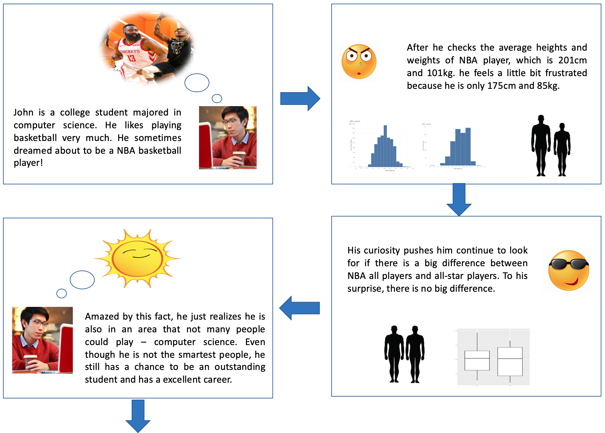

# Storyboard
Here the story begins by presenting a fictitious international college student who love both his major-computer science and basketball. He wants to be a good programmer in the future but he also dreams about playing basketball in NBA. He does some research of NBA players' data and realizes that it would be very hard for him to be a NBA player. Meanwhile, he also feels pressure in his major because he thinks most of his classmates are smarter than him. Then he wants to see among all NBA players, do all-star NBA players have advantages in physical conditions? To his surprise, all-star players almost have the same heights and weights comparing to all players. This brings confidence to him. Now he knows that those physical conditions won't stop him from being an excellent student in computer science and have a good career in the future. By checking the changing rate of foreign player also brings him the confidence that U.S. gives fare chance to foreign people as long as they work hard.

  
  

# Wireframe
In the wireframe I am trying to piece everything together to guarantee both the diversity and consistency. My topic is about a college student's inspiration from his NBA dream. I divided the whole topic into four part: Origin, Curiosity, Research and Inspiration. This structure is derived from part I.
  
  

# User research
Interviewee A
- Did you know this information before reading the story?
	- a little about NBA 
- What population group do you think this story is intended for?
	- International students in US
	- NBA fans
- What do you think is the purpose of this story?
	- To encourage international student to pursue the life they want, also keep work life balance.
- What did you find confusing? What would you change?
	- Some pictures is not clear, pie charts  not clear enough
	- Ending comes in a sudden 
- Other questions?
	NBA job market is not similar to coding job market.

Interviewee B
- Did you know this information before reading the story?
	- Barely
- What population group do you think this story is intended for?
	- People interested in NBA
	- People want to pursue CS career
- What do you think is the purpose of this story?
	- To show a linkage between foreign player could play a big role in US.
- What did you find confusing? What would you change?
	- The transition from NBA career dream to CS career happens too quick
	- Describe this transition more reasonable.
- Other questions?
	- Make graph more clear, bigger.

Interviewee C
- Did you know this information before reading the story?
  - No, This is first time.
- What population group do you think this story is intended for?
  - I think this story is for the people who like to see/play basketball or want to be a basketball player.
- What do you think is the purpose of this story?
  - Data can precisely tell the correct information.
  - And from data perspective, no difference between star player and normal players.
  - It sounds there are another factors like practice time or speed etc..
- What did you find confusing? What would you change?
  - John is 175 cm and 85kg. So by just checking the NBA average, it’s easy to see whether there is a chance to be a basketball player or not.
  - Why do you need to check the difference b/w star players and normal players?
- Other questions?
  - As you described, there is no difference between star players and normal players from heights and weights perspective. So are there any possible factors that there is an exact different portion between them?

# Reference
- College student picture: https://www.uml.edu/Images/Computer-Science-Student-800_tcm18-235070.jpg
- NBA playing: https://a.espncdn.com/photo/2019/1020/nba_new_season_preview_1296x729.jpg
- Career picture: https://ismartlearn.com/wp-content/uploads/2019/05/career-options-647.jpeg
- Laptop picture: https://icdn6.digitaltrends.com/image/digitaltrends/school-coding-416x416.jpg
- Playing basketball:https://mambasportsacademy.com/wp-content/uploads/2020/01/2-kids-playing-basketball-at-mamba-sports-academy.jpg

