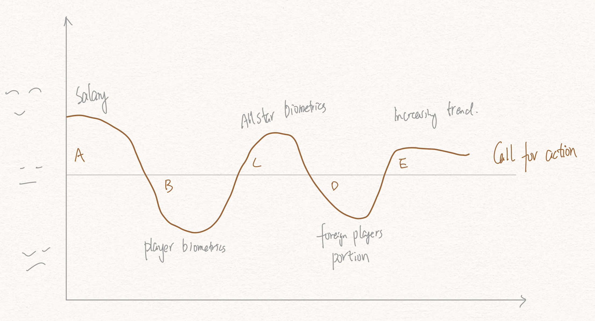
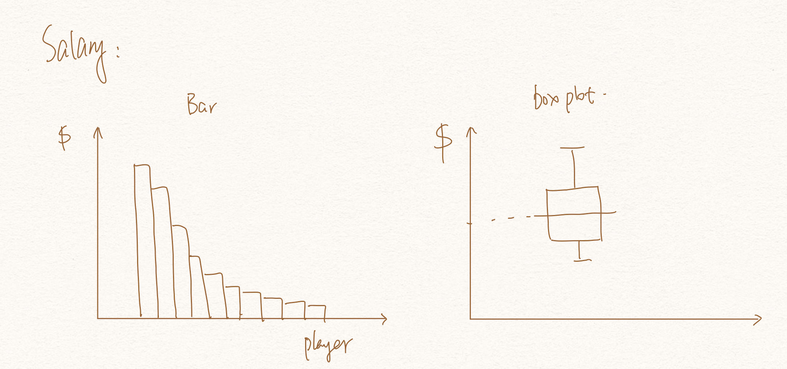
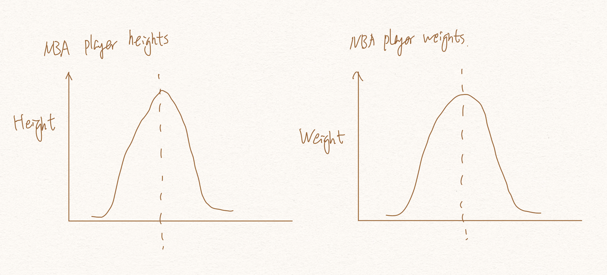
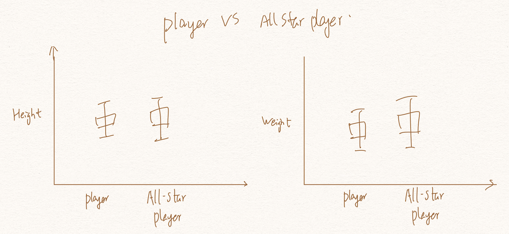
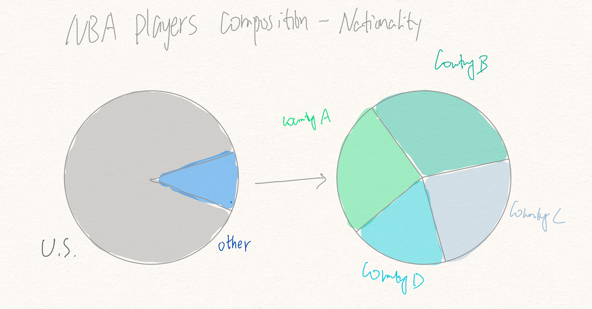
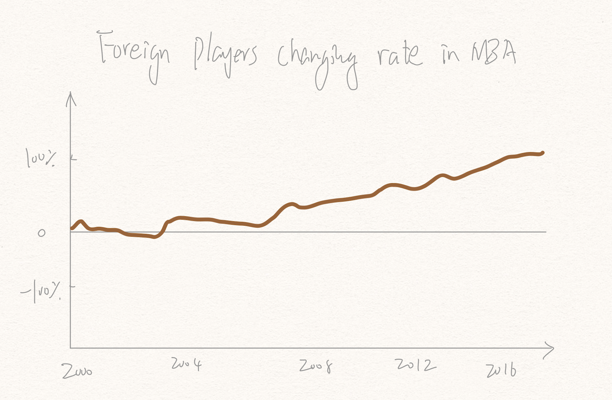

# Outline

- Summary

This is a project about the showing the stories and data visualization of some interesting facts about NBA. As a basketball fan, NBA is defenitely a big place to pay attention to. I konw that all NBA palyers are very tall and strong, and their salaries are also crazy high. However, I want to know the exact values of their heights, weights and salaries. I also want to dig more information from those players. I want to know many things including but not limit to:
    - What are the weights and hieights distribution for NBA players?
    - What are the weights and hieights distribution for NBA all star players?
    - Are the player's salary matching their performance?
    - Are top drafted players doing better than other players?
    - What are the portions of foreign players in NBA and how did they performance?
    
Besides, what inspiration could those data bring to people? Most people, for sure, do not have those exceptional body characteristics. What can we learn from the data from those NBA giants? To answer those questions, I found some very useful public data about NBA from Kaggle. Combining what I learned from this class, I want to choose the most effective ways of visualization to show the data and also want to discover the inspiration of those data to people. 

- Story arc and elements
  - arc drawing:
  
  
  
  - (+) Stage A
    - Very high salaries of NBA players 
  - (-) Stage B
    - Create tension 
    - The height and weight distribution for NBA players and show that it is difficuilt to be a NBA player
    - It's not easy to be a NBA players
  - (+) Stage C
    - Create relief
    - Among all NBA players, all star players don't outstand other players in those standards(also provide some T test for picky audience)
    - This tell us as long as you are in one area, like us, some will be data analyst in the future, your pythical condition can not stop from you being a outstanding data analyst
    - ALso show how top drafted players perform during next five year, including the salary, game performance index.
  - (-) Stage D
    - Create another tenstion
    - By far, how do you think the portion of foreign players in NBA? show the portion of foreign players overall.
  - (+) Stage E
    - Relief again
    - NBA is open to more and more players around the world. Just train hard and you will get the oppotunity.
  - Call for action
    - love what you love, do what you do. Don't feel unqualified if you are not a top beginner in the road, also don't feel overpride if you begin your job with a high skilled equipment. Stick to the things that you love and work hard and you will get the job done
    - It doesn't matter that much if you are a top pic or not, this also applies everwhere. You need to work hard to get to your goal. You don't need to be dicoffident if you didn't start as a top biginner. You also need to word hard if you are a top biginner.
 

# Sketches
- Stage A

- Stage B

- Stage C

- Stage D

- Stage E

# Data
Data 1 :
NBA players data
https://www.kaggle.com/justinas/nba-players-data
General information of NBA player data will be extracted here.

Data 2:
NBA all star games 2000-2016
https://www.kaggle.com/fmejia21/nba-all-star-game-20002016
General information of all star NBA player data will be extracted here.

Data 3:
NBA - Player Salary (1990-2017)
https://www.kaggle.com/whitefero/nba-player-salary-19902017
Salary information of NBA players will be extracted here.

Data 4:
NBA Draft 1980-2017
https://www.kaggle.com/pmp5kh/nba-draft-19802017
Information of drafted players is from here.

# Method and medium
The whole project will be built upon the outlines. Some charts may be redesigned to better convey the idea of the project. More details like() may be added to the project and the dataviz will be realized in Shorthand platform.

